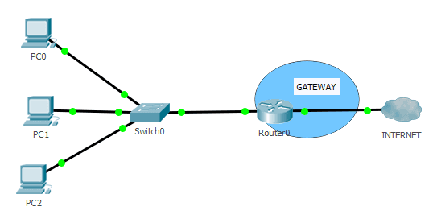

# 1.10. Pasarelas


La **pasarela** es un equipo informático configurado para dotar a las máquinas de una red de área local (LAN) conectadas a él de un acceso hacia una red exterior, generalmente realizando para ello operaciones de traducción de direcciones de red. Esta capacidad de traducción de direcciones permite aplicar una técnica llamada enmascaramiento de IP, usada muy a menudo para dar acceso a Internet a los equipos de una LAN compartiendo una única conexión a Internet, y por tanto, una única dirección IP externa.


## ¿Qué es una pasarela?

· Una **pasarela** (puerta de enlace) es un dispositivo, con frecuencia un ordenador, que permite interconectar redes con protocolos y arquitecturas diferentes a todos los niveles de comunicación. Su propósito es traducir la información del protocolo utilizado en una red al protocolo usado en la red de destino.

## ¿Cómo funcionan las pasarelas?

· Las **puertas de enlace** simplemente transmiten paquetes de datos para que puedan ser comprendidos. Cuando una pasarela recibe un paquete, lo traduce del formato usado en la red de origen a un formato común entre compuertas, y luego lo envía a otra compuerta, la cual después de recibirlo lo traduce del formato común al formato usado en la red destino, y por último lo envía a esta.

## ¿A que nivel trabajan?

· Una pasarela modifica el empaquetamiento de la información de la red de origen para acomodarse a la sintaxis de la red de destino, por lo que suelen trabajar en el nivel más alto del modelo OSI, el de Aplicación. De esta forma, pueden conectar redes con arquitecturas completamente distintas.

## Precios a los que se puede conseguir

· El precio de una puerta de enlace pueden variar dependiendo de la marca y el rendimiento de la pasarela. Los precios están a torno a 100€, 150€ los más baratos y los más caros pueden rondar los 3000€.

## Especificaciones de un producto real

·**Producto**: TP-Link ER7206 Switch 4 Puertos Gigabit + 1 SFP

·**Marca**: TP-Link

·**Modelo**: TL-ER7206

·**Especificaciones generales:**

&#x20;   \- Conexión Ethernet WAN: Si.

&#x20;   \- Estándares de red: IEEE 802.1Q,IEEE 802.3,IEEE 802.3ab,IEEE 802.3u.

&#x20;   \- Tipo de interfaz ethernet: Gigabit Ethernet.

&#x20;   \- Tecnología de cableado: 10/100/1000Base-T(X).

&#x20;   \- Ethernet LAN, velocidad de transferencia de datos: 10,100,1000 Mbit/s.

&#x20;   \- Soporte VLAN: Si.

&#x20;   \- Ethernet LAN (RJ-45) cantidad de puertos: 4.

&#x20;   \- Memoria Flash: 132 MB.

&#x20;   \- Memoria interna: 512 MB.

&#x20;   \- Tipo de memoria interna: DRAM.

·**Precio:** 174,33€

·**Web del fabricante**: https://www.tp-link.com/es/

·**Web del vendedor**: https://www.pccomponentes.com/

.webp>)


Página realizada por: Fermín Pozo Gómez

