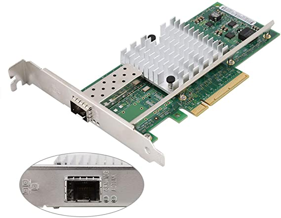

# 1.2. Tarjetas de interfaz de red (NIC)

### ¿Qué son las Tarjetas de red?

Es un componente de hardware que conecta una computadora a una red informática y que posibilita compartir recursos (como archivos, [discos duros](https://es.wikipedia.org/wiki/Disco\_duro) enteros, [impresoras](https://es.wikipedia.org/wiki/Impresora) e [internet](https://es.wikipedia.org/wiki/Internet)) entre dos o más [computadoras](https://es.wikipedia.org/wiki/Computadora), es decir, en una [red de computadoras](https://es.wikipedia.org/wiki/Red\_de\_computadoras).

## Tarjeta de Red RJ45

.jpg>)

## Tarjeta de Red SFP

## ¿Qué es un SFP?

Un SFP, o Small Form Factor Pluggable (factor de forma pequeño conectable), es un transceptor compacto e intercambiable en caliente diseñado para admitir Ethernet de 100 / 1000 Mbps, Fibre Channel y SONET, entre otros estándares de comunicación. Los transceptores SFP admiten velocidades de hasta 4,25 Gbps y se utilizan comúnmente en aplicaciones de telecomunicaciones y comunicaciones de datos. Encontrará puertos SFP en una gran variedad de dispositivos, desde conmutadores Ethernet a routers, tarjetas de red y firewalls. La especificación Small Form Factor Pluggable (SFP) se basa en los estándares IEEE802.3 y SFF-8472.

## ¿Cómo funcionan las tarjetas red?

¿**Cómo funcionan las tarjetas de red**? Las **tarjetas de red** se encargan de preparar, transferir y controlar la información o datos que envía a los otros equipos que están conectados en una misma **red**, no se trata de solo ordenadores, también equipos como impresoras y discos duros externos pueden establecer una conexión.



### Diferencias entre puertos RJ45 y SFP en switches de red

* Tipos de conexión:
  * En este sentido, los **puertos RJ45** van a admitir cables de Ethernet como CAT5, CAT6, etc. Son los cables comunes que utilizamos para conectar, por ejemplo, un ordenador a un router o un switch. En cambio los **puertos SFP** son más completos, ya que admiten módulos de cable de conexión de fibra óptica (tanto monomodo como multimodo), así como los cables CAT5e, CAT6, CAT7, CAT8…
* Distancia Máxima:
  *   La **distancia máxima** que permiten cada una de las opciones varía también mucho. Los puertos RJ45 son útiles hasta una distancia máxima de 100 metros.&#x20;

      Por otra parte, los puertos SFP sí permiten una mayor distancia. Incluso hablamos de kilómetros, según el caso. Los cables MMF pueden ofrecer 10 Gbps a una distancia de hasta 550-600 metros. Pero además, los cables SMF pueden alcanzar hasta 150 kilómetros.&#x20;
* Latencia:
  *   También hay diferencias en cuanto a **latencia** a la hora de conectar dispositivos a cierta distancia. En este sentido los puertos SFP tienen una menor latencia respecto a los puertos RJ45 que pueden dar un peor servicio cuando conectamos equipos a una distancia considerable.

      Esto es importante para navegar por Internet y para utilizar muchos servicios que requieren que haya una latencia mínima. Si vamos a conectar un ordenador por cable al router y estamos cerca, a apenas unos metros, no vamos a tener grandes complicaciones. En cambio, si esa distancia va a ser mucho mayor sí que podría perjudicarnos. En este sentido los puertos SFP vuelven a ser una mejor alternativa.
* Consumo:
  *   Especialmente para una empresa u organización que va a tener muchos equipos conectados en red, el consumo puede variar significativamente. Los puertos SFP tienen un menor **consumo** frente a los puertos RJ45.

      No obstante, para un uso doméstico o pequeña empresa en la que vamos a conectar apenas unos cuantos ordenadores o equipos de redes, no vamos a notar una gran diferencia. Además, los switches de red actuales están muy bien optimizados y prácticamente todos cuentan con características de ahorro energético para que el consumo sea lo menor posible.
