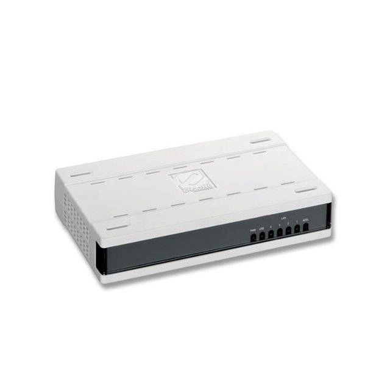

# 1.3. Modems


El **modem** ha sido utilizado desde hace muchos años para establecer las **conexiones de Internet** de nuestros equipos informáticos. Actualmente se hace casi necesario estar conectados a Internet, la red de redes, donde podemos encontrar prácticamente cualquier cosa que busquemos. Uno de los dispositivos clave para la historia de Internet es el modem, y hoy veremos de qué se trata, cómo funciona y cuáles fueron los primeros pasos de estos dispositivos.


### Un poco de historia...

**Con el modem precisamente comienza la era de Internet**, si Graham Bell levantara la cabeza, alucinaría con lo que se ha conseguido gracias a sus invenciones. Pues bien, todo comenzó allá por 1958, que fue cuando se inventó el **primer modem**. Perece muy lejano, pero la mayoría de nuestros padres nacerían por aquella época. Al menos los que somos de los 80-90. En este modem se consiguió transmitir datos binarios en una línea telefónica...

### ¿Qué es un modem?

En los comienzos de Internet, uno de los medios de transmisión más utilizados para la conexión de datos era la **Red Telefónica Básica** o (RTB), la cual tenía una amplia cobertura y un coste relativamente bajo. De hecho, se utilizaba la propia red de cableado que sirve para la transmisión de voz. El problema que tenía utilizar esta red es que **las señales eran de tipo analógico** (voz) y no digital (datos).

Precisamente de esta necesidad de convertir las señales analógicas en digitales, nació el **modem** o **MOdulador/DEModulador**. Entonces **un modem es un dispositivo capaz de convertir las señales digitales en analógicas**, proceso llamado “**modulación**”, y también es capaz de **convertir las señales analógicas en digitales**, a cuyo proceso se le llama “**demodulación**”.

Lo que hace un modem básicamente es permitir la comunicación entre nuestro ordenador e Internet a través de la **red de telefonía** o del llamado **cablemoden**, que usa la red de televisión por cable, algo que ya nos sonará a antiguo.

### ¿Cómo funciona un modem?

El modem recibe la información del **proveedor de servicios de Internet** (ISP) a través del teléfono o de un cable. Al recibir esta señal, el modem la convierte en digital y la envía al dispositivo que esté conectado. En un modem solamente se puede conectar un dispositivo a la vez, ya que **no cuenta con capacidad de enrutamiento** **múltiple** como sí son capaces los actuales routers.

Para entender este proceso de “traducción” de una señal analógica en digital y viceversa, tendremos que entender un poco sobre las ondas y sus características.

A la hora de transmitir información, debemos diferenciar dos tipos de señales:

* La **señal portadora**
* La **señal moduladora**

Estas señales son, en definitiva, **ondas sinusoidales** **que son las encargadas de llevar la información desde un punto a otro**. Estas ondas tienen tres parámetros importantes:

* La **frecuencia** (Hz)
* La **amplitud** (Voltios)
* La **fase** (grados)

&#x20;En primer lugar, la información se procesa para introducirla en una **señal moduladora**, esta acción es la que hace el modem, preparara y modula la información. A continuación, se emite una **señal portadora** que será modificada en algún aspecto por la señal moduladora, digamos que le da una característica única para diferenciarla de otras señales que existan en el medio de transmisión. De esta forma podremos transmitir los **datos modulados**, para que puedan ser demodulados en el otro extremo de la conexión. El proceso de demodulación consistirá en extraer la señal moduladora original de la señal portadora, y así convertir la señal en datos útiles para el equipo.

### Tipos de modulación

Existen tres formas de modificar una portadora, se hará modificando alguna de las tres características de la frecuencia.

* **Modulación por amplitud**: en esta modulación se modifica el patrón de amplitud de la onda que se transmite. Se le llama:
  * **ASK** o **AM** (amplitud modulada).
* **Modulación por frecuencia**: en este caso estaríamos modificando la frecuencia de la onda transmitida, modificando su período en distintas frecuencias. También se denomina:
  * &#x20;**FSK** o **FM** (frecuencia modulada).
*   **Modulación por fase**: en el último caso estaremos modificando la fase de la onda transmitida. También se denomina:

    * &#x20;**PSK** o **PM**.

### Tipos de Modem

Veamos ahora los tipos de modem que han existido a lo largo del tiempo:

* **Modem Interno**: estos modem consisten en una tarjeta de expansión que se conecta a la placa base de nuestro ordenador. Consistirá en una PCB con los componentes propios de un modem y una interfaz basada en el bus ISA, AMR o mediante PCI los últimos fabricados.

* **Modem Externo**: en este caso tendremos un dispositivo que se conecta al ordenador mediante puerto serie, por ejemplo, USB. Generalmente se utilizan para realizar las funciones de contestador automático o fax.

* **Modem externo PCMIA**: son también módems externos, pero de un tamaño inferior a los anteriores y conectados mediante PCMCIA a ordenadores portátiles.

### Conectores

Los Conectores que tienen los modem por norma general suelen ser:

* Entradas de Rj11.
* Entradas Rj45.
* Entrada de alimentación.
* Entrada cable Coaxial (Opcional)
* Usb (Opcional)

Aquí adjunto una imagen de ejemplo:

Realizado por José María Jiménez Cabrero
