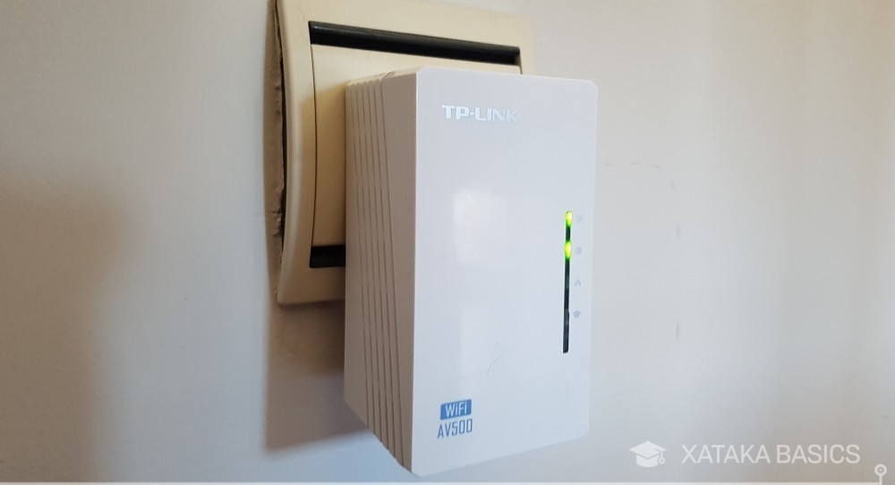

# 1.4. Repetidores

## ¿Qué son los repetidores?


Un repetidor es un dispositivo electrónico que recibe una señal débil o de bajo nivel y la retransmite a una potencia o nivel más alto, de tal modo que se puedan cubrir distancias más largas sin degradación o con una degradación tolerable


### Características

Los repetidores son equipos que trabajan a nivel 1 de la pila [OSI](https://www.ecured.cu/OSI), es decir, repiten todas las señales de un segmento a otro a nivel eléctrico.

Estos equipos sólo aíslan entre los segmentos los problemas eléctricos que pudieran existir en algunos de ellos.

El número máximo de repetidores en cascada es de cuatro, pero con la condición de que los segmentos 2 y 4 sean [IRL](https://www.ecured.cu/index.php?title=IRL\&action=edit\&redlink=1), es decir, que no tengan ningún equipo conectado que no sean los repetidores. En caso contrario, el número máximo es de 2, interconectando 3 segmentos de red.

El repetidor tiene dos puertas que conectan dos segmentos [Ethernet](https://www.ecured.cu/Ethernet) por medio de transceivers (instalando diferentes transceivers es posible interconectar dos segmentos de diferentes medios físicos) y [cables drop](https://www.ecured.cu/index.php?title=Cables\_drop\&action=edit\&redlink=1).

El repetidor tiene como mínimo una salida Ethernet para el cable amarillo y otra para teléfono. Con un repetidor modular se pude centralizar y estructurar todo el cableado de un edificio, con diferentes medios, adecuados según el entorno, y las conexiones al exterior.

## Se dividen en dos grupos repetidores wifi y cableados.

## ¿Cómo funcionan los repetidores wifi?

En cuanto a su funcionamiento, este viene a ser bastante simple. Los repetidores WiFi contienen dos enrutadores inalámbricos. Con uno se recoge la señal WiFi existente de tu hogar, la cuál se transifere al segundo para transmitirla de nuevo potenciada para que tenga más alcance y llegue a las esquinas donde la cobertura del router no llega.

[Un ejemplo de funcionamiento](https://www.xataka.com/perifericos/guia-basica-para-comprar-repetidor-wi-fi-consejos-seleccion-modelos-para-todos-bolsillos) sería el siguiente. Imagina que tienes tu router instalado en una habitación, y que en tu salón no llega señal suficiente como para poder conectar un dispositivo a la WiFi. Entonces, lo que harías con este amplificador es conectarlo en una zona intermedia donde llegue bien la señal de la WiFi, y desde donde el amplificador pueda emitir una señal que alcance al salón.

El hecho de mencionar la una zona intermedia no es al azar, y es que **el sitio donde coloquemos el repetidor es clave** para su correcto funcionamiento. Tienes que ponerlo en una especie de punto intermedio entre el sitio donde está el router y la zona hasta donde quieres que llegue la cobertura.

Evidentemente, también te tienes que asegurar de que **en ese punto intermedio reciba buena señal del router** para así poder ampliarla correctamente. Por lo tanto, tiene que ser en ese sitio hasta el que la cobertura de tu WiFi llega mal, pero a partir del cuál empieza a deteriorarse. Lo que harás al poner ahí este repetidor es precisamente que emita señal como si estuviera ahí el router y que llegue más lejos sin problemas.

A diferencia de los PLC, otra alternativa que amplía la cobertura llevando la señal de la WiFi por el cableado eléctrico, con los amplificadores WiFi **no necesitas comprar ningún tipo de pack**, ya que sólo es necesario un único dispositivo para ampliar la red WiFi. Eso hace de ellos una alternativa más económica.

Además, tampoco dependes de cómo esté el cableado eléctrico de tu casa. Eso sí, el repetidor **va a necesitar estar conectado a un enchufe** para tener la energía suficiente para poder funcionar y hacer sus tareas. El PLC puede ser especialmente útil en casas grandes donde no es suficiente un repetidor para abarcar todas las zonas, pero en la mayoría es más que suficiente para mejorar tu conexión.

### Qué debes tener en cuenta en un repetidor Wifi.

* **Facilidad de conexión**: Poner en marcha un repetidor Wi-Fi es algo muy sencillo. Básicamente necesitarás conectarlo a la corriente y conocer tanto el nombre de la red como la contraseña. Pero todavía puede ser más fácil, mediante configuración protegida - denominada abreviadamente [WPS](https://www.xataka.com/basics/wps-que-sirve-este-boton-que-trae-algunos-routers) - que conectará este repetidor con tu Wi-Fi simplemente pulsando un botón en ambos dispositivos.
* **Diseño**: El diseño más frecuente de los repetidores de corriente es el de un pequeño bloque de plástico que se conect
* ará directamente a un enchufe. Suelen tener un par de luces LED para que sepamos a simple vista que están encendidos y la fuerza de la señal, así como antenas. Otros repetidores Wi-Fi, generalmente más complejos, disponen de más puertos, opciones y más caros, tienen una estética similar a los de los routers.
* **Estándares de seguridad**: El modelo de repetidor Wi-Fi que compres debería integrar WPA2-PSK (AES), el último estándar y más seguro que existe hasta la fecha. Estos estándares hacen referencia al método de encriptación empleado, algo que evitará que una persona ajena a tu red acceda a ella. Si quieres evitar intrusos, [elegir el mejor sistema de cifrado es una de las medidas](https://www.xataka.com/ordenadores/como-proteger-tu-wifi-por-completo) para evitarlo.

Los estándares de seguridad disponibles son, ordenados de mejor a peor:

1. WPA2 + AES
2. WPA + AES
3. WPA + TKIP/AES
4. WPA + TKIP
5. WEP
6. Red abierta

## Repetidores cableados

### Se llaman PLC

### ¿Qué es un PLC?

El PLC es un sencillo dispositivo que te permite **transmitir la señal de tu conexión a Internet a través del cableado eléctrico de tu casa**, tanto WiFi como Ethernet. De esta manera, si tienes el router en una habitación y la señal no llega al salón, puedes llevarla a través de los enchufes para tener allí más cobertura.

**Los PLC utilizan dos tipos de dispositivo**. El primero será siempre uno que se encarga de recoger la señal de tu WiFi e "inyectarla" dentro de la red eléctrica. Y luego tendrás el extensor, que es al que le llegará la señal a través de los cables de la casa y que la repetirá en la zona en la que lo tengas enchufado. Incluso puedes utilizar dos extensores para que la señal llegue a diferentes puntos de tu casa.

[Su funcionamiento](https://www.xataka.com/basics/como-mejorar-la-cobertura-de-tu-wifi-en-casa-utilizando-unos-plc) es extremadamente sencillo. Lo único que vas a tener que hacer es conectar tu router al emisor mediante un [cable ethernet](https://www.xataka.com/basics/cable-red-ethernet-categorias-protecciones-como-saber-cual-comprar), que es el mismo que va del router al ordenador para llevar la conexión por cable en vez de por WiFi, y luego conectas el emisor al enchufe más cercano. Después, simplemente enchufa el extensor en cualquier otro enchufe de tu casa y actuará como si fuera un router enviando la señal hasta esa zona.

Los PLC pueden **utilizarse de diferentes maneras** dependiendo de cómo quieras configurar tu conexión. Para empezar, tendrás la opción de que la WiFi que genere el extensor sea la misma de tu router o que puedas elegir un nuevo nombre y contraseña para ella. Además, el extensor no sólo ampliará la señal creando un punto WiFi, sino que en algunos modelos también incluirá conectores ethernet para conectar otros dispositivos por cable.

Los PLC los vas a poder comprar con diferentes kits. Estos pueden ser con un receptor y un extensor, pero también hay marcas que los comercializan con varios extensores para que puedas ampliar la red por varios puntos de tu casa o con diferentes nombres y contraseñas para la WiFi. También podrás comprar cada uno de estos elementos por separado.

## Ventajas y desventajas wifi vs cableado.

| VENTAJAS PLC               | VENTAJAS REPETIDOR WIFI        |
| -------------------------- | ------------------------------ |
| Mejor rendimiento          | Sólo necesita un único aparato |
| Más opciones de red        | Precio ligeramente inferior    |
| Permite mayores coberturas | Muy fáciles de configurar      |
| Conexión mas estable       | No dependen de tomas de luz    |

## Desventajas Wifi vs Cableado

| DESVENTAJAS PLC                  | DESVENTAJAS ADAPTADOR WIFI            |
| -------------------------------- | ------------------------------------- |
| Depende del cableado de tu casa  | Depende de la señal del router        |
| Mayor precio                     | Menor rango de cobertura              |
| Funciona peor con regletas       | Puedes perder velocidad por el camino |
| Necesitas más de un dispositivo  | Peor en pisos grandes y casas         |

## ¿Cuándo es mejor utilizar uno u otro?

Si necesitas más versatilidad pudiendo elegir entre WiFi o Ethernet o un rendimiento óptimo de la señal es muy posible que tengas que invertir en un PLC. **Sobre todo si vives en un piso grande o una casa con varias plantas**, ya que el adaptador WiFi será menos efectivo a la hora de llevar la señal de una punta a otra o a pisos inferiores.

Pero salvo estos casos específicos, **por lo general casi siempre será suficiente con un adaptador WiFi**. Son más económicos y sencillos al utilizar sólo un dispositivo, y si tu piso no es especialmente grande no debería darte problemas a la hora de llevar la señal de una zona a otra. También son especialmente útiles en las oficinas, donde la existencia de regletas podría penalizar el uso del PLC.

Realizado por Armando Antonio Merino García-Cervigón.

