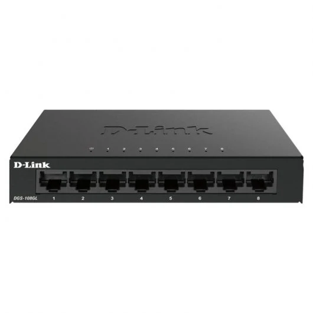

# 1.5. Concentradores


El **concentrador o repetidor** es el dispositivo que permite centralizar el cableado de una red de computadoras, para luego poder ampliarla. No logran dirigir el tráfico que llega a través de ellos, y cualquier paquete de entrada es transmitido a otro puerto que no sea el puerto de entrada.


## ¿Qué es un concentrador?

· El **concentrador o repetidor** es un dispositivo simple con una única misión, la de interconectar los ordenadores de una red local.

## ¿Cómo funciona un concentrador?

· Su funcionamiento es sencillo, cuando alguno de los ordenadores de la red local que están conectados a él le envía datos, el concentrador los replica y trasmite instantáneamente al resto de ordenadores de esta red local.

.png>)

## ¿A que nivel trabaja?

· El concentrador trabaja en la capa 1 del modelo OSI, la capa física, reagrupando el conjunto de flujos de redes en sus puertos.

## Precios a los que se puede conseguir

· Los precios de los concentradores puede variar en función de la marca, el número de puertos que ofrezca y el material con el que estén fabricados. De media un concentrado tiene un precio entre los 10€, 15€ los más baratos y pueden llegar hasta los 90€ y 100€.

## Especificaciones de un producto real

·**Producto**: D-Link DGS-108GL Switch 8 Puertos Gigabit

·**Marca**: D-LINK

·**Modelo**: DGS-108GL

·**Especificaciones generales**:

&#x20;   \- Puertos básicos de conmutación RJ-45 Ethernet: 8.

&#x20;   \- Puertos tipo básico de conmutación RJ-45 Ethernet: Gigabit Ethernet (10/100/1000).

&#x20;   \- Capacidad de conmutación: 16 Gbit/s.

&#x20;   \- Tasa de reenvío: 11,9 Mpps.

&#x20;   \- Tabla de direcciones MAC: 4000 entradas.

·**Precio**: 21,90€

·**Web del fabricante**: https://eu.dlink.com/es/es

·**Web del vendedor**: https://www.pccomponentes.com/


Página realizada por: Fermín Pozo Gómez

