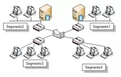

# 1.6. Puentes

Es un dispositivo que conecta dos redes de área local (LAN) o dos segmentos de la misma LAN, posiblemente con protocolos de transmisión distintos.

### _Las funciones son las siguientes:_

1. División de la red LAN en segmentos o subredes. Cuando una LAN se hace demasiado grande, en cuanto a número de puestos o extensión, debe ser dividida para optimizar su funcionamiento.
2. Interconexión de dos redes LAN, pudiendo tener protocolos de nivel dos o medios de transmisión distintos.
3. Controlar las tramas defectuosas.

los puentes reciben todos los paquetes de información enviados por cada red acoplada a él, y los reenvían selectivamente entre las LAN's que incluyan el equipo terminal al cual va dirigida la transmisión, descartando o filtrando aquellos que no necesitan ser retransmitidos o haya detectado que son defectuosos.

Cuando un puente inicia su función por primera vez, no tiene ninguna información sobre los equipos de las redes que interconecta. Sin embargo, a medida que va analizando tramas y comprobando las direcciones de procedencia, crea una base de datos o mapa de direcciones que usará posteriormente.

Realizado por Antonio Manzano Garcia
