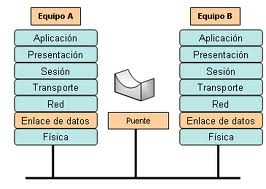

# 1.6. Puentes

### ¿Que son?

Es un dispositivo que conecta dos redes de área local (LAN) o dos segmentos de la misma LAN, posiblemente con protocolos de transmisión distintos.

### _Las funciones son las siguientes:_

1. División de la red LAN en segmentos o subredes. Cuando una LAN se hace demasiado grande, en cuanto a número de puestos o extensión, debe ser dividida para optimizar su funcionamiento.
2. Interconexión de dos redes LAN, pudiendo tener protocolos de nivel dos o medios de transmisión distintos.
3. Controlar las tramas defectuosas.

Los puentes reciben todos los paquetes de información enviados por cada red acoplada a él, y los reenvían selectivamente entre las LAN's que incluyan el equipo terminal al cual va dirigida la transmisión, descartando o filtrando aquellos que no necesitan ser retransmitidos o haya detectado que son defectuosos.

Cuando un puente inicia su función por primera vez, no tiene ninguna información sobre los equipos de las redes que interconecta. Sin embargo, a medida que va analizando tramas y comprobando las direcciones de procedencia, crea una base de datos o mapa de direcciones que usará posteriormente.

Un puente de red o bridge es un dispositivo de interconexión de redes que opera en la capa 2 (nivel de enlace de datos) del modelo OSI.&#x20;

&#x20;Un bridge conecta segmentos de red formando una sola subred (permite conexión entre equipos sin necesidad de routers). Funciona a través de una tabla de direcciones MAC detectadas en cada segmento al que está conectado. Cuando detecta que un nodo de uno de los segmentos está intentando transmitir datos a un nodo del otro, el bridge copia la trama para la otra subred, teniendo la capacidad de desechar la trama (filtrado)&#x20;

El puente se justifica cuando:

* Se quieren unir dos redes sin un router.
* Cuando se desea aislar el tráfico de red que conecta el puente

Cuando un puente debe traspasar una trama de un segmento a otro de la red ejecuta las acciones

* Almacena la trama recibida por cualquier puerto para su posterior análisis.
* Comprueba la integridad de la trama.  Si está incorrecta o incompleta la elimina.
* Reconfigura el formato de la trama al segmento de red destino.
* Reexpide la trama al segmento de red accesible por alguno de sus puertos.

Al operar a nivel 2 actúa con direcciones MAC y no puede tomar decisiones de encaminamiento (nivel 3). El aislamiento de tráfico que efectúan los puentes o dispositivos de red de nivel superior se le suele denominar "separación de los dominios de colisión" ya que dos host colocados en segmentos de red diferentes no pueden colisionar en su acceso a la red

### Se clasifican en:

* **Transparentes**. No requieren ninguna configuración para su funcionamiento.
* **No transparentes**.  Necesitan que la trama lleve información sobre el modo que ha de ser reexpedida.

### Los puentes se clasifican al ámbito de actuación en:

* **Locales**. Une dos o más segmentos de una misma red.
* **Remotos**. Está dividido en dos partes, cada uno de ellas tiene conectado un segmento de red y las dos partes se unen a través de la línea de una red WAN.

Los puntos de acceso inalámbricos suelen tener un modo bridge para que puedan realizar esta función.

.png>)

Realizado por Antonio Manzano García
