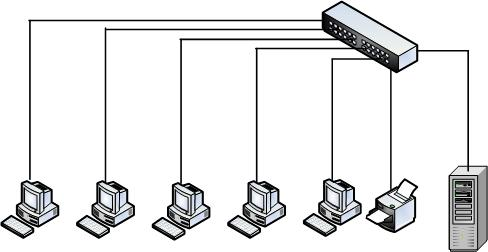
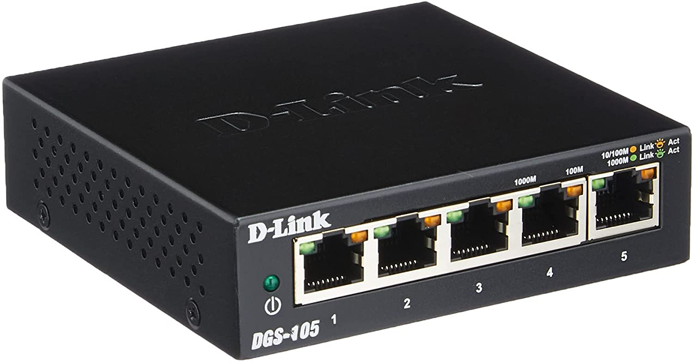

# 1.7. Conmutadores


Los conmutadores se utilizan cuando se desea conectar múltiples tramos de una red, fusionándolos en una sola red. Al igual que los puentes, dado que funcionan como un filtro en la red y solo retransmiten la información hacia los tramos en los que hay el destinatario de la trama de red, mejoran el rendimiento y la seguridad de las redes de área local (LAN).


## ¿Qué es un conmutador?

Un conmutador es un dispositivo digital lógico de interconexión de equipos. Su función es interconectar dos o más host de manera similar a los puentes de red, pasando datos de un segmento a otro de acuerdo con la dirección MAC de destino de las tramas en la red y eliminando la conexión una vez finalizada esta.

## ¿Cómo funciona un conmutador?

La función principal de un switch es la de unir o conectar dispositivos en red. Es importante tener claro que un switch no proporciona por si solo conectividad con otras redes, y obviamente, tampoco proporciona conectividad con Internet.

Sirve para que cada dispositivo conectado que mande mensajes o archivos a otro dispositivo concreto. Para hacerlo, el switch lee la dirección MAC de la tarjeta de red del dispositivo, que es como la matrícula con que cada aparato puede ser identificado en una red física.

## Historia del conmutador

Fue creado en 1832, inventado y desarrollado por William Sturgeon y desarrollado como dispositivo de red por compañías telefónicas. Este invento fue importante por que permitió Interconectar dos o más segmentos de una misma red para el enlace de datos, funcionando como un puente.

En sus inicios se usaban generalmente en redes telefónicas y que gracias a la evolución de nuevas tecnologías de comunicación(impulsadas fundamentalmente por los telegrafistas en su carrera por conseguir mejores comunicaciones). Ahora se utilizan también en complejas redes de ordenadores, conectando puertos unos con otros y redes unas con otras.

Los conmutadores poseen la capacidad de aprender y almacenar las direcciones MAC de los dispositivos alcanzables en la red mediante sus puertos de conexión . También se pueden conectar entre sí dos conmutadores siempre y cuando entre ellos exista un único camino, de lo contrario se produce un bucle o ciclo provocando una inundación en la red con la consiguiente caída de las comunicaciones.

## Tipos de conmutador

### 1. Conmutador compacto

Es un conmutador de pequeño tamaño dotado de todas las funciones necesarias para la creación de una red confiable.

### 2. Conmutador modular

Los conmutadores modulares ofrecen más flexibilidad en su configuración. Habitualmente, los conmutadores modulares vienen con chasis de diferentes tamaños que permiten la instalación de diferentes números de tarjetas de líneas modulares. Cuanto más grande es el chasis, más módulos puede admitir.

### 3. Conmutador apilable

Un conmutador apilable es un conmutador de red completamente funcional que funciona de forma independiente, pero que también se puede configurar para funcionar junto con uno o más conmutadores de red. Este grupo de conmutadores muestra las características de un solo conmutador pero tiene la capacidad de puerto del suma de los conmutadores combinados.

El propósito del diseño de apilamiento es para crecer la densidad de puertos. Cuando se utilizan conmutadores independientes, cada conmutador se gestiona, soluciona problemas y configura como una entidad individual. Por el contrario, los conmutadores apilables proporcionan una forma de simplificar y aumentar la disponibilidad de la red.

### 4. Conmutador multicapa

Un conmutador multicapa es un dispositivo de red que tiene la capacidad de operar en capas superiores del modelo de referencia OSI, a diferencia de la capa de enlace de datos (DLL) utilizada tradicionalmente por los conmutadores.

Puede realizar las funciones de un conmutador y la de un enrutador a velocidades increíblemente rápidas.

## ¿A qué nivel trabajan?

Los conmutadores trabajan en la capa 2 en el modelo de capas de OSI, en la capa de enlace de datos, porque utilizan las direcciones MAC del hardware de los dispositivos conectados. Estas direcciones son únicas y específicas de cada fabricante de dispositivos que cuentan con un puerto de red, es por ello que la comunicación se queda en esencia en el conmutador.

## Precios a los que se puede conseguir

Los precios pueden variar depende del tipo de conmutador que sea, dependiendo de su marca, el fabricante, la velocidad máxima que soporten, etc. Los precios pueden oscilar entre los 15€ y los 500€, dependiendo de la calidad del producto.

## Especificaciones de un producto real

·Producto: D-Link DGS-105 - Switch de red

&#x20;·Marca: D-Link

&#x20;·Modelo: DGS-105

&#x20;·Especificaciones generales:

&#x20;    \- Consta de cinco puertos Gigabit RJ-45, 10/100/1000 Mbps

&#x20;    \- Tecnología D-Link Green, para lograr hasta un 80 % menos de consumo de energía.

&#x20;    \- Soporta jumbo frames con tramas de datos de hasta 9.000 bytes.

&#x20;    \-Potencia eléctrica de 2.75 vatios.

&#x20;·Precio: 17,99€

&#x20;·Fabricante: [https://eu.dlink.com/es/es](https://eu.dlink.com/es/es)

&#x20;·Vendedor: [https://www.amazon.es/](https://www.amazon.es/)


Página realizada por: Fermín Pozo Gómez

