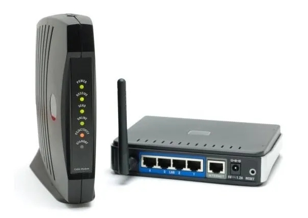

# 1.8. Enrutadores

## Historia de los Router

El primer Router jamás creado fue el Interface Message Processor, por sus siglas IMP, que formaba parte de ARPANET

Al principio, estos primeros intentos de encaminadores eran poco confiables, pues realizaban las rutas y los envíos sin conexión directa a la red

Con la llegada del protocolo TCP/IP y de la invención de nuevas tecnologías de análisis de redes, en donde la empresa Xerox estuvo muy implicada, aparecieron los primeros enrutadores multiprotocolo. Estos usaron por primera vez direcciones en red activas para calcular las rutas de envíos con de los paquetes.

En la actualidad, con el mejoramiento de los protocolos de IP, de los que se incluyen el IPv4 e IPv6, y de los enrutadores multiprotocolo de alta eficiencia, ha sido posible crear Router para cada necesidad

## ¿Qué son?

Es un dispositivos electrónico que se dedica a controlar y administrar la interconexión de redes entre computadores y servidores.

Es un dispositivo hardware o software de interconexión de redes de ordenadores/computadoras que opera en la capa 3 (nivel de red) del modelo OSI o nivel IP y ICMP del modelo TCP\IP. Este dispositivo interconecta segmentos de red o redes enteras.

## Tipos de Router

A continuacion mostramos algunos tipos de Router:

1. Router de Distribucion
2. Router de Nucleo
3. Router de Acceso
4. Router inalambrico&#x20;
5. Router ADSL

A continuación veremos los tipos de Router&#x20;

1. ##
2. ## Router de núcleoRouter de núcleo


Son Router que, a diferencia de los anteriores, están conectados a más de dos redes. Este tipo de Router sí mantiene como principal función la de “enrutar” datos entre las diferentes redes a las que están conectados y deben estar preparados para procesar una gran cantidad de información


## **2.Router de núcleo**


Estos Router son **capaces de mantener distintas conexiones de redes de alta velocidad**. Por lo que se utilizan principalmente como soporte de los proveedores de internet


## Router de Acceso


Se utiliza para denominar enrutadores domésticos o de empresas pequeñas, también llamados enrutadores de acceso. Son capaces de administrar redes públicas y privadas con conexión mediante banda ancha


## Router inalámbrico


_Router especiales que pueden actuar como un puente entre distintos tipos de redes móviles_

Son utilizados dentro de las empresas de telecomunicaciones como equipos de soporte para sus servicios de redes de internet móvil.


## Router ADSL


Son routers que permiten la conexión entre redes cableadas locales, aisladas o conectadas a su vez a una red de internet. Se utilizan normalmente en sitios que requieren de redes locales propias como empresas o cibercafés.


##

****

## Características de los Router

#### Seguridad

Todos los Router pueden ofrecer distintos niveles de seguridad a las redes locales, estén conectadas o no a una red mayor como la Internet

Dichos filtros o cortafuegos (en inglés firewall) evitan que paquetes de datos no solicitados lleguen a computadores conectados a una red.

#### Acceso y distribución

Debido a que los router gestionan todos los paquetes de una red, son capaces de redistribuir el tráfico de la misma. Evitando así la congestión y enlentecimiento de la red

#### Conectividad a internet

Pueden conectar esas redes locales al internet, sin que por ello se vea afectado la distribución de las rutas de la red local

## Diferencias entre Router y módem


El módem se conecta directamente a la red de internet, modulando los tipos de señales telefónicas que le llegan. Por su parte el router no necesariamente está conectado a la red de internet, pero si a los equipos locales interconectados entre sí (todas los computadores conectados en un hogar o una empresa). \* \* Los módem usan siempre conexiones cableadas, ya sean al recibir líneas telefónicas de cobre, o fibra óptica. Mientras que los Router pueden no requerir estar conectados por cables, ya que pueden enrutar las redes locales mediante señales inalámbricas como el Wifi.


Realizado Por Antonio Manzano García
