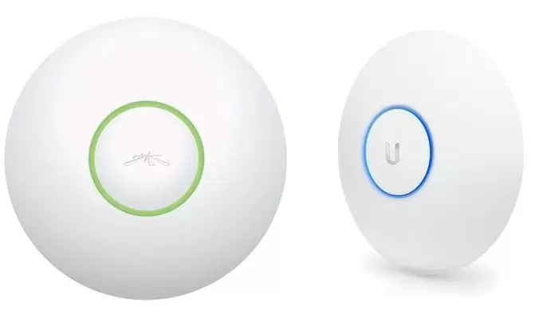

# 1.9. Puntos de acceso


La **tecnología Wi-Fi cada vez está mas presente** por la libertad de movimiento y capacidad para acceder a la red que ofrece desde cualquier punto dentro del rango de cobertura. Por eso, cada vez son más los esfuerzos por mejorar y desarrollar nuevos dispositivos para este tipo de redes. No obstante, con un router Wi-Fi podemos atender necesidades en hogares y oficinas pequeñas, pero no en grandes empresas o lugares donde hay gran cantidad de conexiones a la vez o con tráficos importantes.

En esos casos, se pueden usar **los puntos de acceso WiFi**, con unas capacidades y funcionalidades que te comentaremos después.


### ¿Qué es un punto de acceso WiFi?

Un **punto de acceso**, como su propio nombre indica, es un dispositivo que permite enlazar con una red inalámbrica. Se usan para oficinas y grandes edificios donde se necesita una buena cobertura y conexión a la red. El punto de acceso no sustituye al router, sino que se conecta directamente al router o switch, hub, modem o lo que tengamos para proveer de una red. La conexión se realiza mediante un cable de red Ethernet, para que la conexión sea mucho más estable que si se hiciese de forma inalámbrica.

Una vez conectado, el punto de acceso se convierte en **un emisor de señal WiFi, proyectando cobertura** para que el resto de equipos del edificio se puedan conectar a él. Es decir, se puede parecer algo a un extensor WiFi de los que hemos hablado en este blog en varias ocasiones o a un PLC, pero no es lo mismo.

### ¿Qué me puede aportar un punto de acceso WiFi?

Como digo, se puede parecer a un extensor o a aparatos similares de los que hemos escrito aquí y que nos pueden ayudar a extender o llevar la señal WiFi a donde antes no se podía. Pero hay algunas diferencias, ya que los extensores o PLCs **no son suficientemente eficientes** para redes profesionales. El motivo es que el número de dispositivos simultáneos a los que pueden dar servicio es bastante limitado. Normalmente no suelen superar la barrera de los 20 dispositivos conectados a la vez.

En cambio, con un punto de acceso WiFi, se pueden **conectar por encima de los 60 dispositivos** de forma simultánea. Y si situamos varios puntos de acceso a lo largo del edificio u oficina, la cantidad de conexiones que podemos tener es bastante elevada, y sin sufrir interrupciones o una merma de la velocidad. Incluso si un miembro se conecta a un punto de acceso y se desplaza por el edificio, se irá conectando a los diferentes puntos de acceso colocados según en la zona en la que se encuentre y no se dará cuenta de fluctuaciones en la conexión.

A parte de la mayor cantidad de accesos simultáneos, un punto de acceso nos puede aportar otros beneficios, como la compatibilidad con **PoE+ (Power over Ethernet Plus)** por lo que no necesitarían de cableado de alimentación adicional, sino que se alimentaría por el mismo cable Ethernet, lo que permite llevar Internet allí donde no hay enchufes cerca para colocar nuestro punto de acceso.

Algunos modelos de punto de acceso incluyen también la función **clustering**, es decir, ofrecer más facilidades a los administradores, que pueden visualizar, monitorizar, instalar, configurar y proteger toda la red completa como una única entidad en vez de tener que ir configurando punto a punto. En este sentido son bastante inteligentes y saben adaptarse a las necesidades. En otros modelos, también podrías encontrar **Portal Cuitivo y ACL** (Access Control List), es decir, listas de control de acceso y medidas de seguridad para decidir qué cuentas de usuario o dispositivos pueden conectarse y cuales no.

### ¿Qué debo saber para elegir el mejor?

Para **comprar un buen punto de acceso wireless** necesitas conocer una serie de detalles técnicos como te vamos a mostrar aquí.

#### Parámetros más importantes:

Todo lo citado en el **apartado técnico** en nuestras guías sobre tarjetas de red, routers neutros, amplificadores, etc., sería también válido para este tipo de dispositivos. Y eso incluye:

* Los estándares del AP WiFi es lo que va a determinar las prestaciones de la red. Si recuerdas, los estándar de la IEEE para redes wireless varía en cuanto a la cobertura y velocidad que podría ofrecer. Por eso, salvo necesidades especiales, no deberías comprar puntos de acceso por debajo de los **802.11n, 802.11ac o 802.11ax**, puesto que son los que ofrecerán mejores prestaciones.
* Si cuentas con dispositivos mixtos que acepten una u otra banda, sería también oportuno que el punto de acceso o AP acepte **Dual Band para que emita en 2.4 Ghz y 5 Ghz**. Recuerda que los antiguos aparatos son compatibles con 2.4 Ghz, y los más modernos con 5 Ghz por las mejores prestaciones y velocidad que ofrece debido a una menor saturación de ese rango de frecuencias. Pero los 2.4 Ghz podrían tener una ventaja más allá de la compatibilidad que he comentado, y es que suelen llegar más lejos porque las ondas de más bajas frecuencias no son tan absorbidas por muros y otras barreras presentes.
* Capacidades **MIMO (Multiple Input – Multiple Output)**, importante para mejorar el rendimiento y prestaciones cuando se trabaja en modo simultáneo trasmitiendo varios streams de datos a la vez. Pero dentro de MIMO existen dos variantes:
  * **SU-MIMO**: Single User MIMO son aquellos que solo permiten que un usuario pueda conseguir datos al mismo tiempo.
  * **MU-MIMO**: MultiUser MIMO permite que varios usuarios puedan conseguir estos datos al mismo tiempo.
* **Compatibilidad con 4G/LTE**, u otras tecnologías como 3G, 2G, etc., esto puede ser intersante para tener un AP portátil que puedas llevar a donde quieras con una tarjeta SIM con la que conectarte por satélite en los lugares donde no hay conexión de otro tipo.

Recuerda, que al igual que los extensores u otros elementos, puedes **comprar packs para agruparlos** a lo largo de todo el espacio WiFi que quieras crear.

En el apartado 2.4 veremos algunos Productos y su coste.


[2.4.-puntos-de-acceso.md](../2.-dispositivos-comerciales/2.4.-puntos-de-acceso.md)


Realizado por José María Jiménez Cabrero
