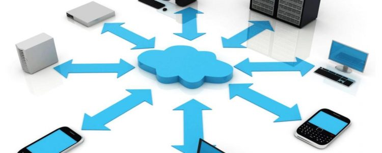
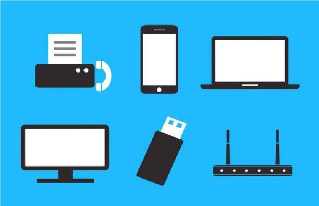

# 2.1. Introducción

## Dispositivos De Comunicación

Los **dispositivos de comunicación** son aparatos que generan y/o reciben señales analógicas o digitales, permitiendo el intercambio de información. Estos medios fueron creados por el ser humano a lo largo de su evolución histórica.

Las computadoras u ordenadores son los más representativos dispositivos de comunicación. Estas máquinas electrónicas han sido diseñadas para recibir, procesar datos y convertirlos en información.

Como dispositivos de comunicación, las computadoras son más rápidas y eficientes con relación a otros dispositivos tradicionales como el teléfono y el correo.

En esta Wiki os enseñaremos un poco mas sobre estos dispositivos.

Os dejamos un poco de lo que actualmente, cuesta un dispositivo de la clase a seleccionar y su fabricante.

