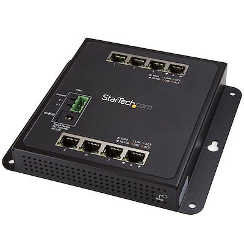

# 2.2.1. Compacto

## Qué es y sus características

Es un conmutador de pequeño tamaño dotado de todas las funciones necesarias para la creación de una red confiable.

## Especificaciones de un conmutador compacto real

·Producto: Switch Ethernet Gigabit de 8 Puertos con Gestión - Switch Gestionado Resistente Compacto GbE L2

·Marca: StarTech

·Modelo: IES81GW

·Especificaciones generales:

&#x20;    \- Ofrece 8 puertos RJ45.

&#x20;    \- Velocidades de transferencia de datos a 10/100/1000/2000 Mbps

&#x20;    \- Bloque de terminales de CC redundante de 12 a 58V

&#x20;    \- Gestión por apilamiento de IPv4 y IPv6 dual

&#x20;    \- Tramas jumbo

&#x20;·Precio: 190,73€

·Web del fabricante: [https://www.esprinet.com/es/](https://www.esprinet.com/es/)

·Web del vendedor: [https://www.amazon.es/](https://www.amazon.es/)

&#x20;


Página realizada por: Fermín Pozo Gómez

