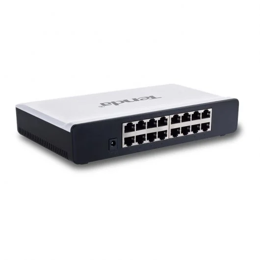

# 2.2.3. Apilable

## Qué es y sus características

Un conmutador apilable es un conmutador de red completamente funcional que funciona de forma independiente, pero que también se puede configurar para funcionar junto con uno o más conmutadores de red. Este grupo de conmutadores muestra las características de un solo conmutador pero tiene la capacidad de puerto del suma de los conmutadores combinados.

El propósito del diseño de apilamiento es para crecer la densidad de puertos. Cuando se utilizan conmutadores independientes, cada conmutador se gestiona, soluciona problemas y configura como una entidad individual. Por el contrario, los conmutadores apilables proporcionan una forma de simplificar y aumentar la disponibilidad de la red.

## Especificaciones de un conmutador apilable real

·Producto: Tenda S16 Switch 16 Puertos 10/100Mbps

·Marca: Tenda

·Modelo: S16

·Especificaciones generales:

&#x20;    \- 16 puertos RJ45 de 10/1000 Mbps con negociación automática.

&#x20;    \- Velocidad de reenvío; 10 Mbps: 14 880 pps o 100 Mbps: 148 800 pps.

&#x20;    \- Tabla de direcciones MAC: 4000 entradas.

·Precio: 25,31€

·Web del fabricante: [https://www.tendacn.com/es/default.html](https://www.tendacn.com/es/default.html)

·Web del vendedor:  [https://www.pccomponentes.com/](https://www.pccomponentes.com/)


Página realizada por: Fermín Pozo Gómez

