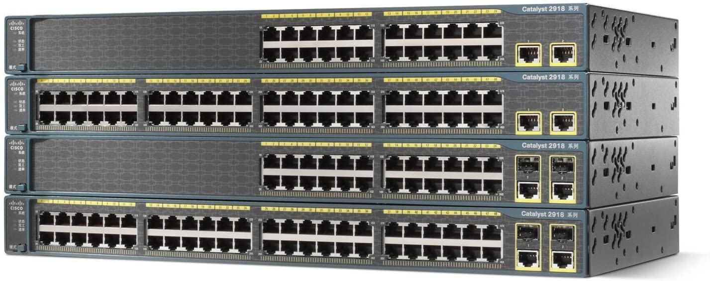

# 2.2.4. Multicapa

## Qué es y sus características

Un conmutador multicapa es un dispositivo de red que tiene la capacidad de operar en capas superiores del modelo de referencia OSI, a diferencia de la capa de enlace de datos (DLL) utilizada tradicionalmente por los conmutadores.

Puede realizar las funciones de un conmutador y la de un enrutador a velocidades increíblemente rápidas.

## Especificaciones de un conmutador multicapa real

·Producto: Cisco Catalyst C3750G-12S-S conmutador Ethernet multicapa

·Marca: Cisco

·Modelo: C3750G-12S-S

·Especificaciones generales:

&#x20;    \- 12 puertos Gigabit Ethernet basados ​​en SFP.

&#x20;    \- Bus de apilamiento de alta velocidad de 32 Gbps.

&#x20;    \- Tecnología de apilamiento innovadora.

&#x20;    \- Conmutador multicapa apilable de 1 RU.

·Precio: 350$

·Web del fabricante: [https://www.cisco.com/c/es\_es/index.html](https://www.cisco.com/c/es\_es/index.html)

·Web del vendedor: [https://www.amazon.es/](https://www.amazon.es/)


Página realizada por: Fermín Pozo Gómez

