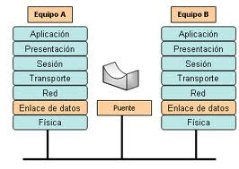

# 2.3. Enrutadores


**TP-Link Archer MR600 V1 Router 4G+ LTE CAT6 AC1200 Wireless Dual Band Gigabit**


## Características

&#x20;

* Primer Router TP-Linkt 4G+ – soportas 4G+ Cat6 para potenciar la velocidad de datos hasta 300 Mbps\*
* Puertos Totalmente Gigabit – proporcionan redes inalámbricas seguras para equipos de ancho de banda intensa como videoconsolas y STP (decodificadores)
* Inserte una tarjeta SIM y navegue – no necesita ninguna otra configuración, compatible con tarjetas SIM de más de 100 países tras años de pruebas de campo
* Mejor Señal para Conexiones en Cualquier Lugar – disfruta de conexiones estables y eficientes para cada equipo gracias a sus dos antenas LTE exernas
* Router modo Wi-Fi – inserte un cable Ethernet en el puerto LAN/WAN para un acceso flexible como un recurso por si no puede tener una conexión 4G

## Especificaciones&#x20;

* Factor de forma de disco SSD: M.2
* SDD, capacidad: 1000 GB
* Interfaz: Serial ATA III
* Tipo de memoria: SLC
* Componente para: Portátil
* Velocidad de lectura: 560 MB/s
* Velocidad de escritura: 530 MB/s
* Soporte S.M.A.R.T.: Si
* ECC: Si
* Cola de comandos nativos (NCQ): Si
* Tiempo medio entre fallos: 1500000 h

...
