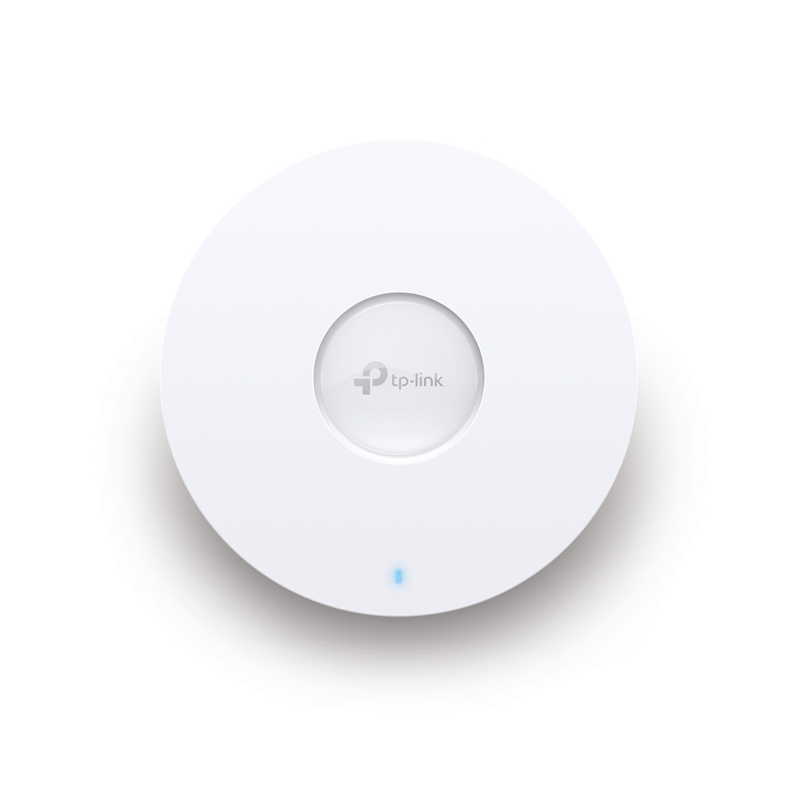

# 2.4. Puntos de acceso

#### TP Link AX3600

Si buscas un modelo de gama alta y compatible con el último estándar 802.11ax (WiFi 6), este modelo es de lo mejor que puedes encontrar tanto en prestaciones como en precio. Incluye además un puerto ethernet de 2.5 Gbps que permite además alimentarlo por PoE.

* Velocidad: 802.11ax con 1148Mbps (2.4Ghz) y 2.4Gbps (5Ghz)
* Antenas: 4×4 MIMO para 2.4 y 5 Ghz (Dual Band) con 4×5 dBi antenas internas
* Puerto ethernet de 2.5 Gbps
* Seguridad: WEP, WPA-PSK, WPA, WPA2 y WPA3ç
* Precio 231€
* Web Fabricante: [https://www.tp-link.com/es/business-networking/omada-sdn-access-point/eap660-hd/#specifications](https://www.tp-link.com/es/business-networking/omada-sdn-access-point/eap660-hd/#specifications)
* Web Vendedor: [https://www.amazon.es/dp/B08GDC61NF?tag=guiahardware-21\&linkCode=ogi\&th=1](https://www.amazon.es/dp/B08GDC61NF?tag=guiahardware-21\&linkCode=ogi\&th=1)

**TP-Link CPE210**

* Velocidad: 802.11n a 300 Mbps
* Antenas: MIMO para 2.4 Ghz con 1 antena interna
* Seguridad: WEP, WPA-PSK, WPA, WPA2
* Extras: admite un buen rango de temperaturas para instalar en exteriores también, soporte multiplataforma, protección IPX5, RJ45
* Precio: 38.57
* Web fabricante: [https://www.tp-link.com/es/business-networking/outdoor-radio/cpe210/#specifications](https://www.tp-link.com/es/business-networking/outdoor-radio/cpe210/#specifications)
* Web vendedor: [https://www.amazon.es/dp/B00OO47F0G?tag=guiahardware-21\&linkCode=ogi\&th=1\&psc=1](https://www.amazon.es/dp/B00OO47F0G?tag=guiahardware-21\&linkCode=ogi\&th=1\&psc=1)


[1.9.-puntos-de-acceso.md](../1.-funcionamiento/1.9.-puntos-de-acceso.md)


Realizado por José María Jiménez Cabrero
